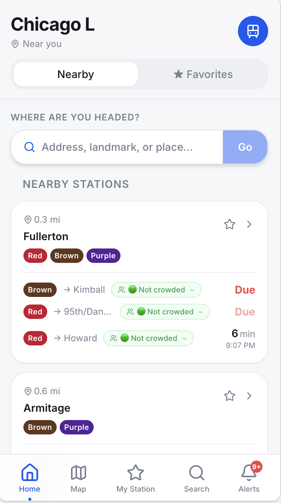
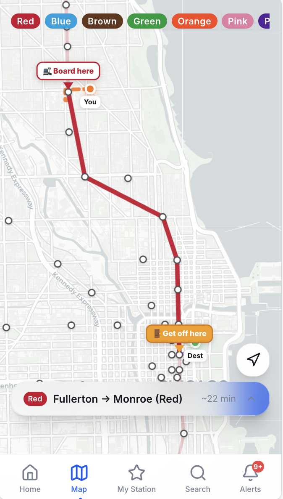

[README (1).md](https://github.com/user-attachments/files/28448559/README.1.md)
# Digital Experience Portfolio
### Mario Gonzalez - CMS Architecture, Digital Workplace Strategy & AI-Enabled Solutions

---

## About This Portfolio

I am a digital platform strategist with 6 years of enterprise CMS ownership, platform architecture, and digital experience design. This portfolio highlights two areas of work: a full enterprise intranet relaunch I led from discovery through sustained adoption, and an AI-powered transit application I built independently.

I am based in Chicago, IL and currently exploring opportunities where I can apply platform strategy, technical leadership, and AI-driven innovation to deliver meaningful digital experiences.

---

## Case Study 1 - Enterprise Intranet Relaunch (ARCH)

### Overview

A national enterprise organization with 4,500 employees and 250+ locations had been running an intranet platform for 7 years with no governance, no content strategy, and no technical oversight. The platform had grown chaotic as the company scaled rapidly from a handful of locations to a national footprint. The result was a digital experience that employees actively avoided.

I led the full relaunch from discovery through deployment and sustained adoption measurement.

---

### The Problem

The platform had three core failure points:

**1. Outdated content and information architecture**
Years of ungoverned content had created a platform where search returned irrelevant results, navigation labels made no sense to users, and outdated resources competed with current ones for visibility.

**2. Navigation and UX that did not reflect how the organization had grown**
The original navigation was built for a 5-company organization. By the time of the relaunch, the company had grown to 250+ locations with multiple lines of business, regional structures, and a complex employee hierarchy. The navigation had never been updated to reflect this reality.

**3. Data and integration chaos**
User data was being fed into the platform from three separate systems - UKG, Paylocity, and MS365 - creating conflicting records, broken filters, and a colleague directory that employees could not trust.

---

### Discovery and Research

Before touching a single page, I ran a structured discovery process designed to surface the truth about how employees actually experienced the platform.

**Employee Survey - 1,000 Respondents**

I designed and deployed an organization-wide survey with the support of the communications team and leadership. The goal was to understand both what was working and what was failing, without creating alarm.

Key findings:

- Only 39% of employees used the platform weekly or daily
- 80% felt neutral or satisfied overall - but the open-ended responses told a different story
- More than half of users relied on search to find information, yet search consistently failed to surface relevant results
- 36% of employees found it difficult to find information
- Nearly 40% of users took 5 minutes or more to find what they needed
- The black navigation bar (50.55%) and Quick Links (40.19%) were the most used homepage elements, suggesting users were navigating by habit rather than by design
- When given the opportunity to describe what would make the platform better, employees asked for: better layout, removal of outdated information, better navigation, better search, and better access to tools

**Focus Groups and Stakeholder Sessions**

I facilitated structured focus groups with employees across departments and conducted multi-part discovery sessions with the platform vendor (Unily) to validate findings and align on a modernization approach. Sessions were recorded and shared with stakeholders for transparency and ongoing alignment.

Key qualitative findings from focus groups:

- Navigation labels were confusing and caused users to feel lost before they even started
- Several navigation sections were no longer relevant to how the business operated
- The blue sub-navigation bar was nearly invisible - most users did not know it was clickable
- There was no dedicated space for the regions, HR, lines of business, sales, or services that had grown significantly since the platform launched

**Platform Analytics Review**

I used the platform's built-in analytics to conduct a full content audit, identifying pages with zero or near-zero views. This data was used to build a weekly content removal list that was reviewed by me and approved by senior leadership before any content was unpublished.

---

### Architecture and Information Design

Based on discovery findings, I redesigned the entire information architecture of the platform.

**Navigation Restructure**

The original navigation had been built for a 5-company startup. I redesigned it to serve a 4,500-person national organization with multiple lines of business and regional structures. The new navigation introduced clear, intuitive labels that reflected how employees actually talked about the organization:

- About Us
- My Resources
- Practices
- Sales
- Regions
- Services

Each top-level navigation item linked to a launchpad - a structured landing experience that allowed users to drill into the specific area they needed rather than facing a wall of content.

**Data Governance and Integration Cleanup**

I worked with IT to audit the data integrations feeding into the platform, mapping which systems (UKG, MS365, Azure, Paylocity) were responsible for which data fields and where conflicts were occurring. This process established a clear source of truth for user data and resolved broken filters, missing offices, and duplicate records in the colleague directory.

**Content Governance Framework**

I established a repeatable content governance process including:

- Naming conventions and tagging standards so content could be found through search
- A content lifecycle protocol defining how content was approved, updated, archived, and deleted
- A weekly content audit process with clear ownership and approval chains
- Admin access levels defining the responsibilities of Content Editors, Content Approvers, and CMS Admins

---

### Admin Network and Training

I built and managed a network of 30+ platform admins across departments throughout this project. This included:

- Defining access levels and governance responsibilities for each admin role
- Creating a full Admin Training Program including a PowerPoint curriculum, monthly editor sessions, and bi-weekly open office hours
- Building scripted how-to documentation (SCRIBE guides) for every major admin task
- Establishing naming convention standards, content lifecycle training, and escalation protocols

---

### Rollout Strategy

The relaunch was executed through a structured 9-week rollout:

- Pre-launch: newsletter mentions, leadership endorsement emails, admin training webinars
- Launch day: platform pop-up notifications, live demo recording published to ARCH, system-wide communications
- Post-launch: reminder emails, user feedback form, live webinar walkthroughs, departmental office hours

---

### Results

**Immediate Post-Launch (Feb 2026)**

| Metric | Change |
|--------|--------|
| Site Visits | +70% |
| Content Views | +65% |
| Platform Searches | +60% |
| App and Tool Opens | +175% |

The +175% increase in app and tool opens was the most significant outcome. It demonstrated that the intranet had transformed from a passive communication channel into an active productivity hub - employees were now using it to access UKG, Marketing Cloud, Awardco, IT Service Desk, and HR Service Desk rather than navigating to those tools directly.

**Sustained Performance (April to May 2026)**

| Metric | Launch Period | Sustained Period | Trend |
|--------|--------------|-----------------|-------|
| Site Visits | +70% | +67% | Sustained |
| Content Views | +65% | +74% | Still growing |
| Searches | +60% | +61% | Sustained |
| App and Tool Opens | +175% | +208% | Still growing |
| Sessions | baseline | +46% | Still growing |

The sustained data is more meaningful than the launch spike. Content views and app opens continued to grow after launch, indicating that the new information architecture and tool integrations created lasting behavioral change rather than a short-term curiosity bump.

---

### Before and After

**Before:** A cluttered homepage with no clear hierarchy, confusing navigation labels, a nearly invisible sub-navigation bar, and a platform employees avoided.

**After:** A clean, structured homepage with intuitive navigation, prominent tool integrations, clear content hierarchy, and a platform employees actively use to get work done.

---

## Case Study 2 - Chicago L: CTA Transit App (In Development)

### Overview

Chicago L is a personal R&D project I have been building using Base44 and Claude AI as primary development tools. The goal was to create a smarter, cleaner way to navigate the Chicago Transit Authority system - surfacing real-time train arrivals, nearby stations, live route mapping, and crowding data in a single mobile-first interface.

I want to be upfront: I used AI-assisted development tools throughout this project. Base44 provided the application scaffolding and deployment environment, and Claude AI helped me work through code logic, debug issues, and accelerate development. I have familiarity with JavaScript and React but I am not a traditional software engineer - this project was an exercise in using modern AI tools to build something real, which I believe is increasingly how software gets built.

That said, the architectural decisions were mine. I scoped the features, designed the data flows, integrated the live CTA API, and made deliberate choices about how the application should work.

---

### What Is Working



The home screen surfaces nearby stations based on GPS location, shows real-time train arrivals with line color coding, displays crowding indicators pulled from live data, and allows users to favorite stations for quick access. The Nearby Stations view shows Fullerton (Red, Brown, Purple) and Armitage (Brown, Purple) with accurate arrival times.



The map view shows GPS-based routing with board and exit indicators, travel time estimates, and all CTA line filters. The example above shows a Fullerton to Monroe route on the Red line, accurately mapped at approximately 22 minutes.

**What is fully functional:**
- Live CTA API integration pulling real train arrival times
- GPS-based nearby station detection
- Route mapping with boarding and exit point indicators
- Crowding data display
- Multi-line filtering (Red, Blue, Brown, Green, Orange, Pink, Purple)
- Alerts, Search, My Station, and Map pages

---

### The Technical Challenge I Am Still Working Through

The hardest unsolved problem is multi-leg route accuracy. When a journey requires transferring between lines, the AI occasionally maps an incorrect train sequence - selecting a train that does not serve the full route. The CTA API returns arrival data per station rather than full route paths, which means the application has to infer the correct sequence of trains from fragmented data points. I have not cracked the transfer logic cleanly yet.

This is the problem I am actively working through. It is a real engineering challenge and I am not pretending otherwise.

---

### A Key Architectural Decision - The API Proxy

One decision I made early that I am proud of was building a server-side proxy to handle CTA API calls rather than making them directly from the client. This keeps the API key out of the browser and gives the application a clean server layer to handle multiple endpoint types.

```typescript
import { createClientFromRequest } from 'npm:@base44/sdk@0.8.25';

const CTA_BASE = 'https://lapi.transitchicago.com/api/1.0';
const ALERTS_BASE = 'https://www.transitchicago.com/api/1.0';

Deno.serve(async (req) => {
  try {
    const body = await req.json();
    const { endpoint, params } = body;

    const key = Deno.env.get('CTA_TRAIN_TRACKER_API_KEY');
    if (!key) {
      return Response.json({ error: 'CTA API key not configured' }, { status: 500 });
    }

    let url;
    if (endpoint === 'arrivals') {
      const { stopId } = params;
      url = `${CTA_BASE}/ttarrivals.aspx?key=${key}&mapid=${stopId}&outputType=JSON`;
    } else if (endpoint === 'vehicles') {
      const { rt } = params;
      url = `${CTA_BASE}/ttpositions.aspx?key=${key}&rt=${rt}&outputType=JSON`;
    } else if (endpoint === 'alerts') {
      url = `${ALERTS_BASE}/alerts.aspx?outputType=JSON&activeonly=true`;
    } else {
      return Response.json({ error: 'Unknown endpoint' }, { status: 400 });
    }

    const res = await fetch(url);
    if (!res.ok) {
      return Response.json({ error: `CTA API error: ${res.status}` }, { status: res.status });
    }

    const data = await res.json();
    return Response.json({ data });

  } catch (error) {
    return Response.json({ error: error.message }, { status: 500 });
  }
});
```

The proxy handles three endpoint types - train arrivals by station, live vehicle positions by route, and active service alerts - with proper error handling throughout. It runs on Deno and uses environment variables for API key management.

---

### Tech Stack

- **Runtime:** Deno (server-side proxy)
- **Frontend:** React, JSX, Tailwind CSS
- **Build:** Vite
- **API:** CTA Train Tracker API (live data)
- **Development tools:** Base44, Claude AI
- **Architecture:** Multi-page React application with dedicated pages for Home, Map, My Station, Search, Stop Detail, and Alerts

---

### What This Project Demonstrates

- Ability to scope, architect, and build a multi-page application from scratch
- Comfort using AI as a development accelerator rather than a shortcut
- Security-conscious thinking - proxying API calls server-side rather than exposing keys client-side
- Persistence with a hard technical problem rather than abandoning it
- Curiosity about real-world data integration and how cities expose transit data through public APIs

---

## Technical Background

| Area | Experience |
|------|-----------|
| CMS Platforms | Unily (6 years), Drupal (4 years), Acquia |
| Frontend | HTML5, CSS3, JavaScript |
| Analytics | Unily Analytics, Google Analytics |
| Integrations | UKG, MS365, Azure, Paylocity, Marketing Cloud, Awardco |
| AI Tools | Claude AI, Base44, Microsoft Copilot (familiar) |
| Project Tools | GitHub, Jira (familiar), Microsoft Teams, SharePoint |
| Currently Learning | PHP fundamentals, REST APIs, WordPress architecture |

---

## What I Bring

Six years of enterprise platform ownership taught me that the best digital experiences are not built by people who only know code or only know strategy. They are built by people who can hold both at the same time - who can sit in a discovery session with HR leadership in the morning, review a data integration with IT in the afternoon, and write a content governance framework before the end of the day.

I am currently deepening my technical foundation in PHP and CMS architecture because I want to be the person who can do all of that and also understand what is happening under the hood.

---

## Connect

**LinkedIn:** linkedin.com/in/mario-gonzalez-72ba5a19a

**Location:** Chicago, IL - open to hybrid and relocation

---

*This portfolio was built to accompany an application to Clarity Partners, LLC. All enterprise platform data has been anonymized and shared in accordance with standard professional portfolio practices.*
